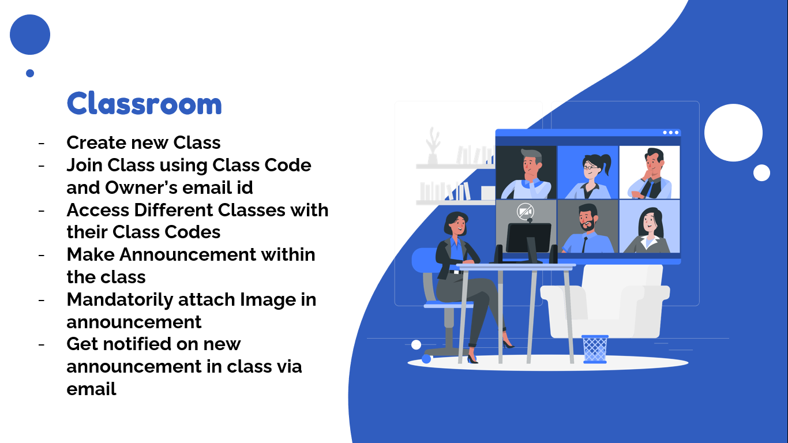
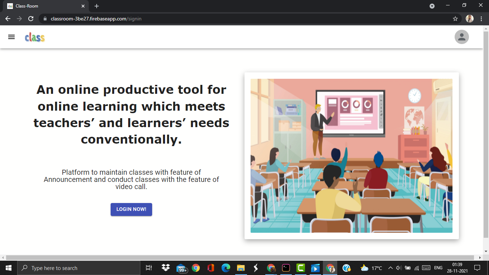
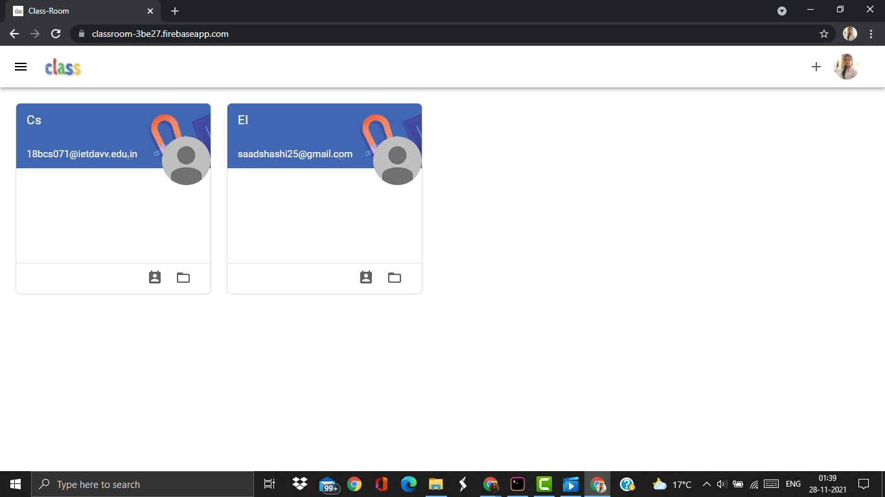
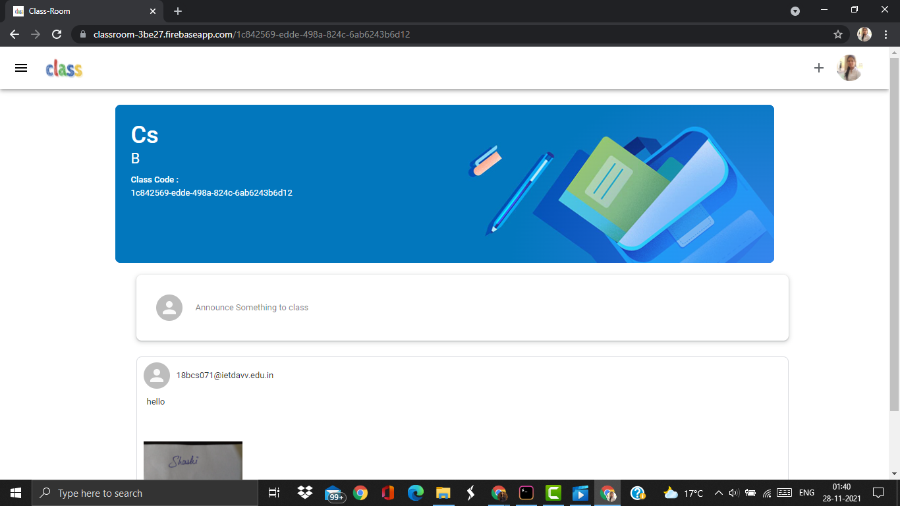
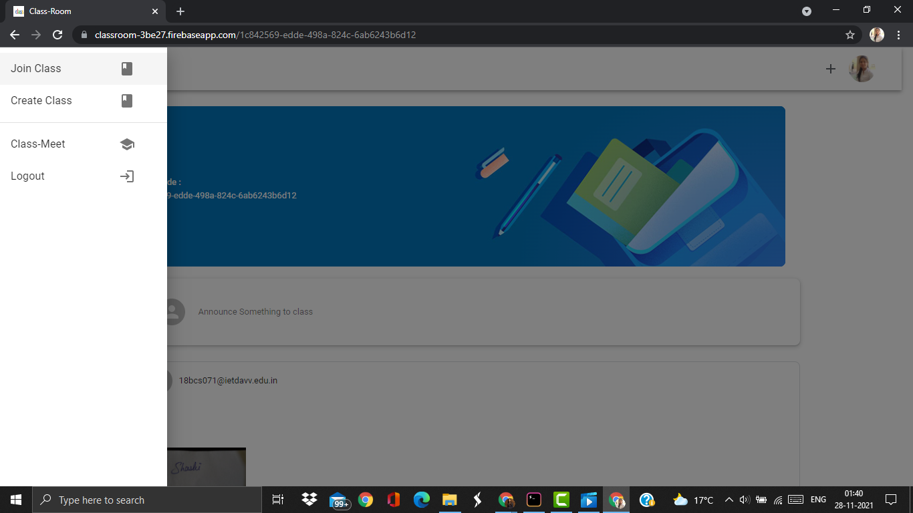
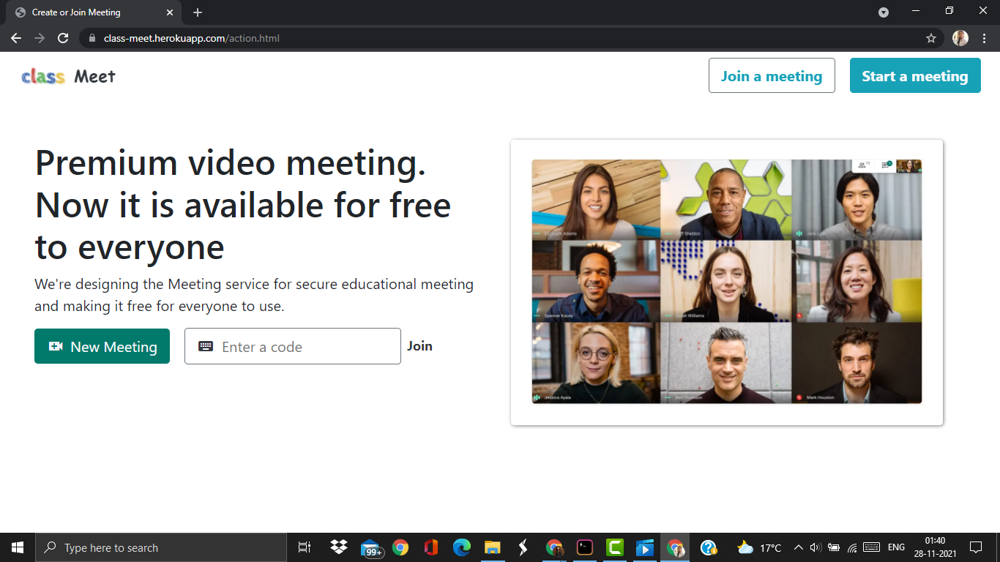
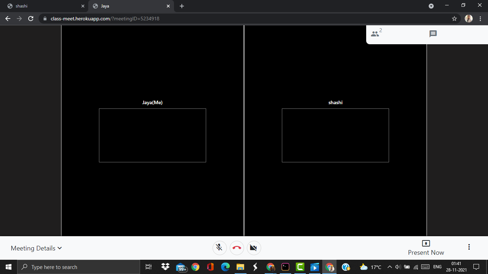
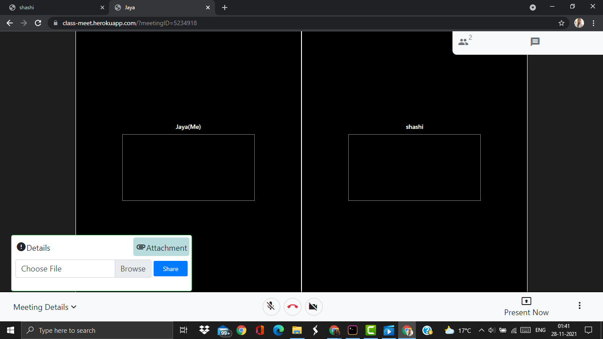
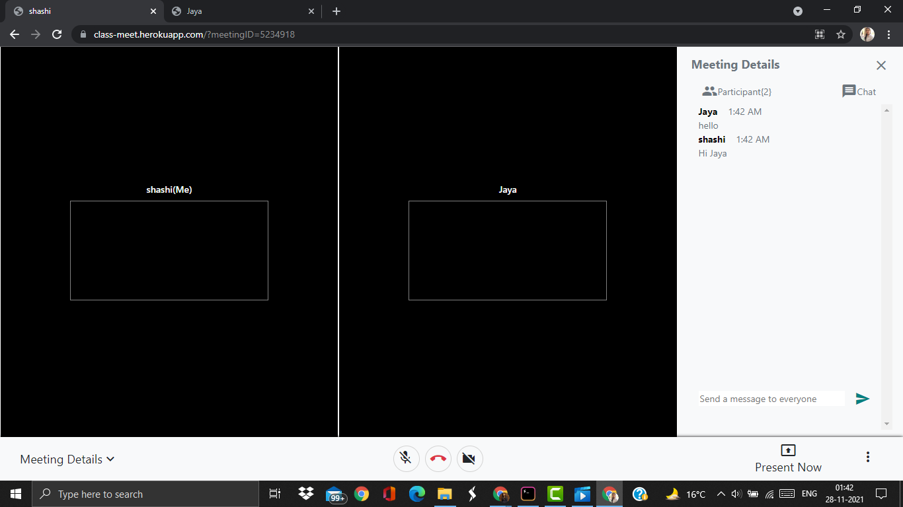
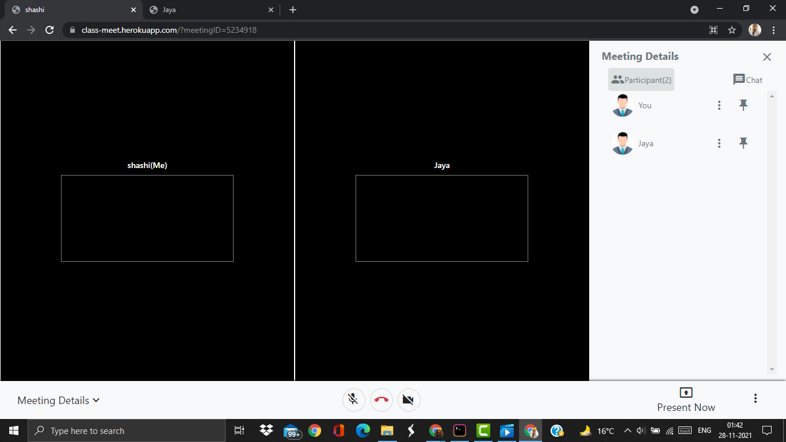

# Class-Meet
## Submission for Microsoft Engage Program 2021
- Project Link : https://classroom-3be27.web.app/signin
- Presentation Link : https://docs.google.com/presentation/d/1Jq3SoPdZtRKrsaODnRIiV96TK5EiyvJB/edit?usp=sharing&ouid=101562045033922839743&rtpof=true&sd=true

## Tech stack
- Reactjs
- Nodejs
- WebRtc
- Socket.io
- Emailjs-com
- Firebase
- Heroku
- jQuery

## Features

User Authentication using Google 

## Screenshots

## Installation
$ git clone https://github.com/shashisad/Class-Meet.git 
$ cd Class-Meet  
 
> for installation of Class-room  
$ cd classroom 
$ npm init  
$ yarn install  
$ yarn start  
It is hosted on firebase. To run on local machine,Open localhost:3000 in browser

> for installation of Class-meet  
$ npm init  
$ npm install  
$ npm start  
It is already hosted on heroku, if you want to run it on localhost:5000,  
Replace Line  36 of Class-Meet/classroom/src/components/Drawer/Drawer.js from 
( window.location.href= 'https://class-meet.herokuapp.com/action.html';)  ( window.location.href= 'http://localhost:5000/action.html';) 

